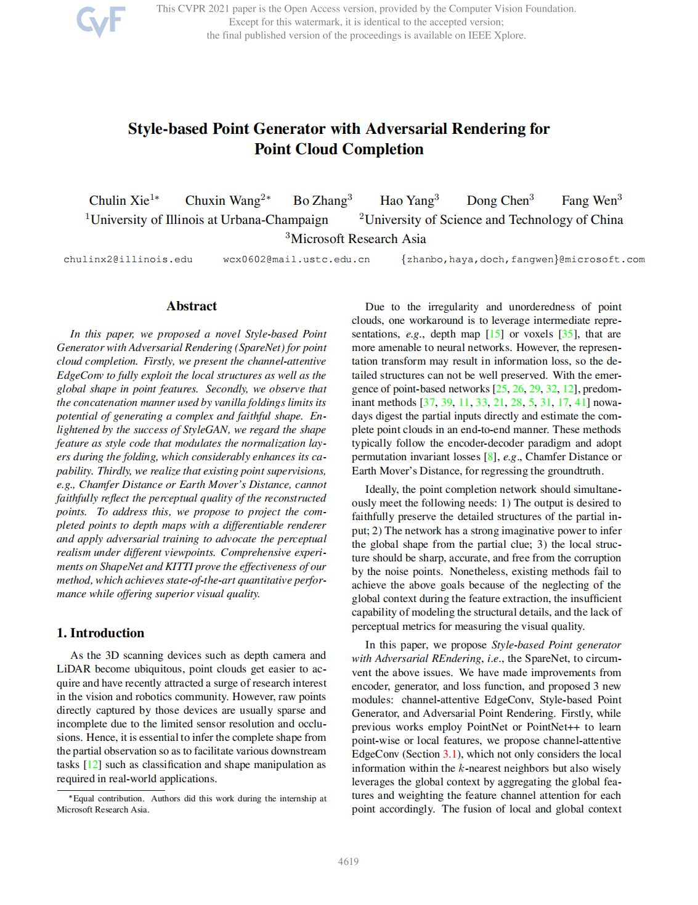

<h2 id="about">Biography</h2>

Hi! I am a PhD student in Department of Automation at [University of Science and Technology of China](https://www.ustc.edu.cn/), advised by Prof. [Weiren Wu](https://en.wikipedia.org/wiki/Wu_Weiren) and [Tianzhu Zhang](https://scholar.google.com/citations?user=9sCGe-gAAAAJ&hl=zh-CN).

My research primarily focuses on 3D computer vision, including vision-3D foundation models, self-supervised/semi-supervised learning, 3D scene understanding, and representation learning. 

Previously, I interned with the Visual Computing Group at [Microsoft Research Asia](https://www.microsoft.com/en-us/research/lab/microsoft-research-asia/) (2020-2021) and [Deep Space Exploration Laboratory](http://www.dsel.cc/#/spaceFile/index) (2024-2025).

 <!-- 空行 -->
**News 🔥**

  <ul>
    <li>Jun. 2025: <a href="https://arxiv.org/pdf/2506.21541">StruMamba3D: Exploring Structural Mamba for Self-supervised Point Cloud Representation Learning</a> was accepted by ICCV 2025.</li>
    <li>May 2025: <a href="https://openreview.net/pdf?id=0gX9f5xTrD">Exploring Vision Semantic Prompt for Efficient Point Cloud Understanding</a> was accepted by ICML 2025.</li>
    <li>May 2025: <a href="https://arxiv.org/pdf/2506.21957">Exploring Semantic Masked Autoencoder for Self-supervised Point Cloud Understanding</a> was accepted by IJCAI 2025.</li>
    <li>Jan. 2025: <a href="https://openreview.net/forum?id=Tisu1L0Jwt">State Space Model Meets Transformer: A New Paradigm for 3D Object Detection</a> was accepted by ICLR 2025.</li>
    <li>Dec. 2024: <a href="https://ieeexplore.ieee.org/document/10815033">RMAE3D: Rethinking Masked Representation Learning for 3D Point Cloud Understanding</a> was accepted by TIP 2025.</li>
    <li>Aug. 2024: <a href="https://arxiv.org/abs/2406.17442">Pamba: Enhancing Global Interaction in Point Clouds via State Space Model</a> was accepted by AAAI 2025.</li>
    <li>Oct. 2023: <a href="https://openaccess.thecvf.com/content/ICCV2023/papers/Wang_Not_Every_Side_Is_Equal_Localization_Uncertainty_Estimation_for_Semi-Supervised_ICCV_2023_paper.pdf">Not Every Side Is Equal: Localization Uncertainty Estimation for Semi-Supervised 3D Object Detection</a> were accepted by ICCV 2023.</li>
    <li>Oct. 2023: <a href="https://openaccess.thecvf.com/content/ICCV2023/papers/Lu_Query_Refinement_Transformer_for_3D_Instance_Segmentation_ICCV_2023_paper.pdf">Query Refinement Transformer for 3D Instance Segmentation</a> were accepted by ICCV 2023.</li>
    <li>Apr. 2023: <a href="https://openaccess.thecvf.com/content/CVPR2023/papers/Deng_SE-ORNet_Self-Ensembling_Orientation-Aware_Network_for_Unsupervised_Point_Cloud_Shape_Correspondence_CVPR_2023_paper.pdf">SE-ORNet: Self-Ensembling Orientation-aware Network for Unsupervised Point Cloud Shape Correspondence</a> were accepted by CVPR 2023.</li>
    <li>May. 2023: <a href="https://ieeexplore.ieee.org/abstract/document/10124821">Long-Short Range Adaptive Transformer With Dynamic Sampling for 3D Object Detection</a> were accepted by TCSVT 2023.</li>
  </ul>

 <!-- 空行 -->
**Experiences 📖**

  Feb. 2024 - Now: Algorithm development intern, DSEL

  Sep. 2021 - Now: PhD Student, USTC

  Jul. 2020 - Jun. 2021: Research intern, MSRA (VC Group)

  Sep. 2017 - Jun. 2021: Undergraduate, USTC

 <!-- 空行 -->
<!-- 
 -->

  <!--  -->
  <!--  -->
  
  
  

 <!-- 空行 -->
<h2 id="publications">Publications</h2>

\* denotes equal contribution. More publications can be found in <a href="https://scholar.google.com/citations?user=0kS2MgIAAAAJ&hl=en">Google Scholar</a>.

<table style="border-collapse: collapse; border: none;">
  <tr style="border: none;">
    <td style="width: 120px; text-align: center; border: none; vertical-align: middle;">
      
    </td>
    <td style="border: none; vertical-align: middle;">
      

        StruMamba3D: Exploring Structural Mamba for Self-supervised Point Cloud Representation Learning
      

      

        <b>Chuxin Wang</b>, Yixin Zha, Wenfei Yang, Tianzhu Zhang
      

      

        ICCV 2025
      

      

        <a href="https://arxiv.org/pdf/2506.21541" style="border:1px solid #ED764A; border-radius:4px; padding:2px 8px; margin-right:4px; text-decoration:none; color:#ED764A;">Paper</a>
      

    </td>
  </tr>

  <tr style="border: none;">
    <td style="width: 120px; text-align: center; border: none; vertical-align: middle;">
      
    </td>
    <td style="border: none; vertical-align: middle;">
      

        State Space Model Meets Transformer: A New Paradigm for 3D Object Detection
      

      

        <b>Chuxin Wang</b>, Wenfei Yang, Xiang Liu, Tianzhu Zhang
      

      

        ICLR 2025
      

      

        <a href="https://openreview.net/forum?id=Tisu1L0Jwt" style="border:1px solid #ED764A; border-radius:4px; padding:2px 8px; margin-right:4px; text-decoration:none; color:#ED764A;">Paper</a>
        <a href="https://chuxwa.github.io/project_DEST/" style="border:1px solid #ED764A; border-radius:4px; padding:2px 8px; margin-right:4px; text-decoration:none; color:#ED764A;">Webpage</a>
        <a href="https://github.com/OpenSpaceAI/DEST3D" style="border:1px solid #ED764A; border-radius:4px; padding:2px 8px; margin-right:4px; text-decoration:none; color:#ED764A;">Code</a>
        <a href="https://chuxwa.github.io/project_DEST/files/poster.pdf" style="border:1px solid #ED764A; border-radius:4px; padding:2px 8px; margin-right:4px; text-decoration:none; color:#ED764A;">Poster</a>
        <a href="https://chuxwa.github.io/project_DEST/files/bib.txt" style="border:1px solid #ED764A; border-radius:4px; padding:2px 8px; text-decoration:none; color:#ED764A;">BibTeX</a>
      

    </td>
  </tr>

  <tr style="border: none;">
    <td style="width: 120px; text-align: center; border: none; vertical-align: middle;">
      
    </td>
    <td style="border: none; vertical-align: middle;">
      

        Rethinking Masked Representation Learning for 3D Point Cloud Understanding
      

      

        <b>Chuxin Wang</b>, Yixin Zha, Jianfeng He, Wenfei Yang, Tianzhu Zhang
      

      

        TIP 2024
      

      

        <a href="https://ieeexplore.ieee.org/document/10815033" style="border:1px solid #ED764A; border-radius:4px; padding:2px 8px; margin-right:4px; text-decoration:none; color:#ED764A;">Paper</a>
        <a href="https://chuxwa.github.io/project_OTMae3D/" style="border:1px solid #ED764A; border-radius:4px; padding:2px 8px; margin-right:4px; text-decoration:none; color:#ED764A;">Webpage</a>
        <a href="https://github.com/OpenSpaceAI/OTMae3D" style="border:1px solid #ED764A; border-radius:4px; padding:2px 8px; margin-right:4px; text-decoration:none; color:#ED764A;">Code</a>
        <a href="https://chuxwa.github.io/project_Nesie/files/bib.txt" style="border:1px solid #ED764A; border-radius:4px; padding:2px 8px; text-decoration:none; color:#ED764A;">BibTeX</a>
      

    </td>
  </tr>

  <tr style="border: none;">
    <td style="width: 120px; text-align: center; border: none; vertical-align: middle;">
      
    </td>
    <td style="border: none; vertical-align: middle;">
      

        Not Every Side Is Equal: Localization Uncertainty Estimation for Semi-Supervised 3D Object Detection
      

      

        <b>Chuxin Wang</b>, Wenfei Yang, Tianzhu Zhang
      

      

        ICCV 2023
      

      

        <a href="https://openaccess.thecvf.com/content/ICCV2023/papers/Wang_Not_Every_Side_Is_Equal_Localization_Uncertainty_Estimation_for_Semi-Supervised_ICCV_2023_paper.pdf" style="border:1px solid #ED764A; border-radius:4px; padding:2px 8px; margin-right:4px; text-decoration:none; color:#ED764A;">Paper</a>
        <a href="https://chuxwa.github.io/project_Nesie/" style="border:1px solid #ED764A; border-radius:4px; padding:2px 8px; margin-right:4px; text-decoration:none; color:#ED764A;">Webpage</a>
        <a href="https://github.com/OpenSpaceAI/Nesie" style="border:1px solid #ED764A; border-radius:4px; padding:2px 8px; margin-right:4px; text-decoration:none; color:#ED764A;">Code</a>
        <a href="https://chuxwa.github.io/project_Nesie/files/bib.txt" style="border:1px solid #ED764A; border-radius:4px; padding:2px 8px; text-decoration:none; color:#ED764A;">BibTeX</a>
      

    </td>
  </tr>

  <tr style="border: none;">
    <td style="width: 120px; text-align: center; border: none; vertical-align: middle;">
      
    </td>
    <td style="border: none; vertical-align: middle;">
      

        Long-short Range Adaptive Transformer with Dynamic Sampling for 3D Object Detection
      

      

        <b>Chuxin Wang</b>, Jiacheng Deng, Jianfeng He, Tianzhu Zhang, Zhe Zhang, Yongdong Zhang
      

      

        TCSVT 2023
      

      

        <a href="https://ieeexplore.ieee.org/abstract/document/10124821" style="border:1px solid #ED764A; border-radius:4px; padding:2px 8px; margin-right:4px; text-decoration:none; color:#ED764A;">Paper</a>
        <a href="https://chuxwa.github.io/project_LeadNet/" style="border:1px solid #ED764A; border-radius:4px; padding:2px 8px; margin-right:4px; text-decoration:none; color:#ED764A;">Webpage</a>
        <a href="https://chuxwa.github.io/project_LeadNet/files/bib.txt" style="border:1px solid #ED764A; border-radius:4px; padding:2px 8px; text-decoration:none; color:#ED764A;">BibTeX</a>
      

    </td>
  </tr>

  <tr style="border: none;">
    <td style="width: 120px; text-align: center; border: none; vertical-align: middle;">
      
    </td>
    <td style="border: none; vertical-align: middle;">
      

        Exploring Semantic Masked Autoencoder for Self-supervised Point Cloud Understanding
      

      

        Yixin Zha*, <b>Chuxin Wang*</b>, Wenfei Yang, Tianzhu Zhang
      

      

        IJCAI 2025
      

      

        <a href="https://arxiv.org/pdf/2506.21541" style="border:1px solid #ED764A; border-radius:4px; padding:2px 8px; margin-right:4px; text-decoration:none; color:#ED764A;">Paper</a>
      

    </td>
  </tr>

  <tr style="border: none;">
    <td style="width: 120px; text-align: center; border: none; vertical-align: middle;">
      
    </td>
    <td style="border: none; vertical-align: middle;">
      

        SE-ORNet: Self-Ensembling Orientation-aware Network for Unsupervised Point Cloud Shape Correspondence
      

      

        Jiacheng Deng*, <b>Chuxin Wang*</b>, Jiahao Lu, Jianfeng He, Tianzhu Zhang, Jiyang Yu, Zhe Zhang
      

      

        CVPR 2023
      

      

        <a href="https://openaccess.thecvf.com/content/CVPR2023/papers/Deng_SE-ORNet_Self-Ensembling_Orientation-Aware_Network_for_Unsupervised_Point_Cloud_Shape_Correspondence_CVPR_2023_paper.pdf" style="border:1px solid #ED764A; border-radius:4px; padding:2px 8px; margin-right:4px; text-decoration:none; color:#ED764A;">Paper</a>
        <a href="https://chuxwa.github.io/project_SE-ORNet/" style="border:1px solid #ED764A; border-radius:4px; padding:2px 8px; margin-right:4px; text-decoration:none; color:#ED764A;">Webpage</a>
        <a href="https://github.com/OpenSpaceAI/SE-ORNet" style="border:1px solid #ED764A; border-radius:4px; padding:2px 8px; margin-right:4px; text-decoration:none; color:#ED764A;">Code</a>
        <a href="https://chuxwa.github.io/project_SE-ORNet/files/bib.txt" style="border:1px solid #ED764A; border-radius:4px; padding:2px 8px; margin-right:4px; text-decoration:none; color:#ED764A;">BibTeX</a>
        <a href="https://chuxwa.github.io/project_SE-ORNet/files/cvpr23_poster_SE-ORNet.pdf" style="border:1px solid #ED764A; border-radius:4px; padding:2px 8px; text-decoration:none; color:#ED764A;">Poster</a>
      

    </td>
  </tr>

  <tr style="border: none;">
    <td style="width: 120px; text-align: center; border: none; vertical-align: middle;">
      
    </td>
    <td style="border: none; vertical-align: middle;">
      

        Style-based Point Generator with Adversarial Rendering for Point Cloud Completion
      

      

        Chulin Xie*, <b>Chuxin Wang*</b>, Bo Zhang, Hao Yang, Dong Chen, Fang Wen
      

      

        CVPR 2021
      

      

        <a href="https://arxiv.org/abs/2103.02535" style="border:1px solid #ED764A; border-radius:4px; padding:2px 8px; margin-right:4px; text-decoration:none; color:#ED764A;">Paper</a>
        <a href="https://alphapav.github.io/SpareNet/" style="border:1px solid #ED764A; border-radius:4px; padding:2px 8px; margin-right:4px; text-decoration:none; color:#ED764A;">Webpage</a>
        <a href="https://github.com/microsoft/SpareNet" style="border:1px solid #ED764A; border-radius:4px; padding:2px 8px; margin-right:4px; text-decoration:none; color:#ED764A;">Code</a>
        <a href="https://alphapav.github.io/SpareNet/files/bib.txt" style="border:1px solid #ED764A; border-radius:4px; padding:2px 8px; text-decoration:none; color:#ED764A;">BibTeX</a>
        <a href="https://alphapav.github.io/SpareNet/files/cvpr21_poster_sparenet.pdf" style="border:1px solid #ED764A; border-radius:4px; padding:2px 8px; text-decoration:none; color:#ED764A;">Poster</a>
      

    </td>
  </tr>

  <tr style="border: none;">
    <td style="width: 120px; text-align: center; border: none; vertical-align: middle;">
      
    </td>
    <td style="border: none; vertical-align: middle;">
      

        Exploring Vision Semantic Prompt for Efficient Point Cloud Understanding
      

      

        Yixin Zha, <b>Chuxin Wang</b>, Wenfei Yang, Xiang Liu, Tianzhu Zhang, Feng Wu
      

      

        ICML 2025
      

      

        <a href="https://openreview.net/pdf?id=0gX9f5xTrD" style="border:1px solid #ED764A; border-radius:4px; padding:2px 8px; margin-right:4px; text-decoration:none; color:#ED764A;">Paper</a>
      

    </td>
  </tr>

  <tr style="border: none;">
    <td style="width: 120px; text-align: center; border: none; vertical-align: middle;">
      
    </td>
    <td style="border: none; vertical-align: middle;">
      

        QRT3D: Query Refinement Transformer for 3D Instance Segmentation
      

      

        Jiahao Lu, Jiacheng Deng, <b>Chuxin Wang</b>, Jianfeng He, Tianzhu Zhang
      

      

        ICCV 2023
      

      

        <a href="https://openaccess.thecvf.com/content/ICCV2023/papers/Lu_Query_Refinement_Transformer_for_3D_Instance_Segmentation_ICCV_2023_paper.pdf" style="border:1px solid #ED764A; border-radius:4px; padding:2px 8px; margin-right:4px; text-decoration:none; color:#ED764A;">Paper</a>
      

    </td>
  </tr>

  <tr style="border: none;">
    <td style="width: 120px; text-align: center; border: none; vertical-align: middle;">
      
    </td>
    <td style="border: none; vertical-align: middle;">
      

        Pamba: Enhancing Global Interaction in Point Clouds via State Space Model
      

      

        Zhuoyuan Li, Yubo Ai, Jiahao Lu, <b>Chuxin Wang</b>, Jiacheng Deng, Hanzhi Chang, Yanzhe Liang, Wenfei Yang, Shifeng Zhang, Tianzhu Zhang
      

      

        AAAI 2025
      

      

        <a href="https://arxiv.org/abs/2406.17442" style="border:1px solid #ED764A; border-radius:4px; padding:2px 8px; margin-right:4px; text-decoration:none; color:#ED764A;">Paper</a>
      

    </td>
  </tr>

  <tr style="border: none;">
    <td style="width: 120px; text-align: center; border: none; vertical-align: middle;">
      
    </td>
    <td style="border: none; vertical-align: middle;">
      

        ScaleDepth: Decomposing Metric Depth Estimation into Scale Prediction and Relative Depth Estimation
      

      

        Ruijie Zhu, <b>Chuxin Wang</b>, Ziyang Song, Li Liu, Tianzhu Zhang, Yongdong Zhang
      

      

        Arxiv 2024
      

      

        <a href="https://arxiv.org/abs/2407.08187" style="border:1px solid #ED764A; border-radius:4px; padding:2px 8px; margin-right:4px; text-decoration:none; color:#ED764A;">Paper</a>
        <a href="https://ruijiezhu94.github.io/ScaleDepth" style="border:1px solid #ED764A; border-radius:4px; padding:2px 8px; margin-right:4px; text-decoration:none; color:#ED764A;">Webpage</a>
        <a href="https://github.com/RuijieZhu94/mmdepth/tree/main/projects/ScaleDepth" style="border:1px solid #ED764A; border-radius:4px; padding:2px 8px; text-decoration:none; color:#ED764A;">Code</a>
      

    </td>
  </tr>

  <tr style="border: none;">
    <td style="width: 120px; text-align: center; border: none; vertical-align: middle;">
      
    </td>
    <td style="border: none; vertical-align: middle;">
      

        EC-Depth: Exploring the consistency of self-supervised monocular depth estimation under challenging scenes
      

      

        Ziyang Song*, Ruijie Zhu*, <b>Chuxin Wang</b>, Jiacheng Deng, Jianfeng He, Tianzhu Zhang
      

      

        Arxiv 2023
      

      

        <a href="http://arxiv.org/abs/2310.08044" style="border:1px solid #ED764A; border-radius:4px; padding:2px 8px; margin-right:4px; text-decoration:none; color:#ED764A;">Paper</a>
        <a href="https://ruijiezhu94.github.io/ECDepth_page/" style="border:1px solid #ED764A; border-radius:4px; padding:2px 8px; margin-right:4px; text-decoration:none; color:#ED764A;">Webpage</a>
        <a href="https://github.com/RuijieZhu94/EC-Depth" style="border:1px solid #ED764A; border-radius:4px; padding:2px 8px; text-decoration:none; color:#ED764A;">Code</a>
      

    </td>
  </tr>

</table>

 <!-- 空行 -->
<h2 id="services">Academic Services</h2>

*Conference Reviewer*
- IEEE Conference on Computer Vision and Pattern Recognition (CVPR)
- International Conference on Computer Vision (ICCV)
- European Conference on Computer Vision (ECCV)
- Conference on Neural Information Processing Systems (NeurIPS)
- Association for the Advancement of Artificial Intelligence (AAAI)
- International Conference on Learning Representations (ICLR)
- International Conference on Machine Learning (ICML)
- International Conference on Artificial Intelligence and Statistics (AISTATS)

*Journal Reviewer*
<!-- - IEEE Transactions on Pattern Analysis and Machine Intelligence (TPAMI) -->
- IEEE Transactions on Image Processing (TIP)
- IEEE Transactions on Circuits and Systems for Video Technology (TCSVT)

 <!-- 空行 -->
<h2 id="honors">Honors and Awards</h2>

  Oct. 2024: First-Class Academic Scholarship for PhD Students, USTC

  Mar. 2024: Outstanding Student, Deep Space Exploration Laboratory, USTC

  Oct. 2023: First-Class Academic Scholarship for PhD Students, USTC

  Oct. 2023: <strong style="color:rgb(240, 92, 38);">National Scholarship of China (Master)</strong>

  Oct. 2022: First-Class Academic Scholarship for Master Students, USTC

  Oct. 2021: First-Class Academic Scholarship for Master Students, USTC

  Jun. 2021: <strong style="color:rgb(240, 92, 38);">Outstanding Graduate and Thesis (Undergraduate), USTC</strong>

  Nov. 2020: <strong style="color:rgb(240, 92, 38);">National Scholarship of China (Undergraduate)</strong>

